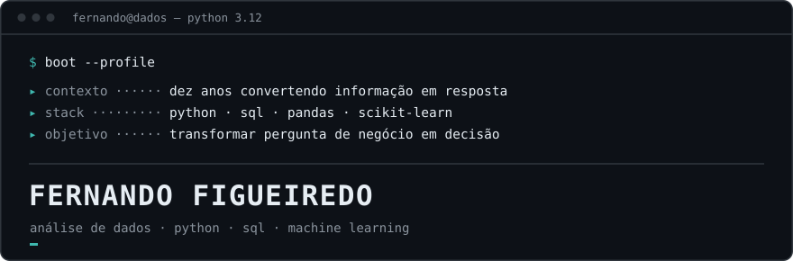

<div align="center">

<picture>
  <source media="(prefers-color-scheme: dark)" srcset="assets/hero-dark.svg">
  <source media="(prefers-color-scheme: light)" srcset="assets/hero-light.svg">
  
</picture>

<a href="https://www.linkedin.com/in/fernandofigueiredoalves/">
  
</a>

**Analista de Dados | Data Analyst** | SQL · Python · Business Intelligence (BI) | IA & Machine Learning | Data Storytelling | 10+ anos em Comunicação Estratégica<br>
Aberto a vagas de Análise de Dados (incluindo júnior) e posições de entrada em Data Science


</div>

---

## `$ whoami`

Transformo informação em resposta há dez anos. A diferença é que agora faço isso com Python, SQL e estatística.

Na EPTV, afiliada da Rede Globo, meu trabalho foi converter contexto disperso — comportamento de audiência, indicadores de alcance, metas comerciais — em entregas que precisavam funcionar e ser medidas. Em 2025, foram **900 peças**, um modelo de produção interna que gerou **R$ 1,5 milhão de economia** e **redução de 83% no custo** frente à terceirização. Nada disso veio de intuição: veio de entender a pergunta certa antes de produzir a resposta.

Análise não é manipular tabelas. É entender o que está sendo perguntado, investigar a evidência, descartar o que não se sustenta e comunicar algo que alguém consiga usar para decidir. A parte técnica dessa cadeia venho construindo de forma estruturada; a outra metade eu já trago pronta — traduzir análise para quem decide. É a diferença entre entregar um notebook e entregar uma resposta.

Mestre em Cinema pela Universidade da Beira Interior (Portugal) e autor de um livro sobre narrativa cinematográfica — formação que me deu método de pesquisa e leitura crítica de evidência.

---

## `$ python -i perfil.py`

```python
from dataclasses import dataclass
from typing import NewType

from pandas import DataFrame

Decisao = NewType("Decisao", str)  # uma resposta que alguém consegue usar


@dataclass(frozen=True)
class Perfil:
    nome: str = "Fernando Figueiredo"
    busca: str = "Analista de Dados · entrada em Data Science"
    nucleo: tuple[str, ...] = ("Python", "SQL", "pandas", "estatística")
    diferencial: str = "dez anos traduzindo análise para quem decide"


def responder(pergunta: str, dados: DataFrame) -> Decisao:
    """O trabalho não começa no dado. Começa na pergunta certa."""
    return (
        dados
        # o que falta, o que se repete, o que mente
        .pipe(auditar)
        .pipe(explorar, guiado_por=pergunta)
        .pipe(modelar, se=exige_previsao(pergunta))
        .pipe(descartar, o_que="não se sustenta na evidência")
        .pipe(traduzir, para="quem precisa decidir")
    )
```

---

## `$ pip list --core`

| Camada | Ferramentas |
|---|---|
| **Dados** | Python · SQL · pandas · NumPy · Parquet |
| **Análise** | estatística descritiva · análise exploratória (EDA) · validação de hipótese |
| **Visualização** | Matplotlib · comunicação de resultado para não-técnicos |
| **Machine Learning** | scikit-learn · regressão · classificação · avaliação e calibração de modelos |

Poucas tecnologias, todas efetivamente usadas. A lista cresce quando houver projeto que a sustente.

## `$ which`

`git` · `pytest` · `jupyter` · `venv` / `pip` · `sqlite` · `parquet`

Controle de versão com histórico legível, teste automatizado e ambiente isolado por projeto — hábito de trabalho, não vitrine.

---

## `$ ls -l ~/projetos`

Repositórios ainda privados enquanto o portfólio é montado. Nenhum link aqui leva a uma página fechada — a publicação acontece quando cada projeto sustentar a própria leitura.

### `milha201` — mistério investigativo em SQL e Python

**Problema.** Bancos de dados gerados por código vazam a própria solução. No benchmark de referência da categoria, uma consulta sobre o *comprimento* dos depoimentos devolve o conjunto de pistas relevante inteiro — sem que o jogador precise entender nada do caso.

**Abordagem.** Escrever a suíte que tenta quebrar o gerador **antes** de gerar qualquer dado: dez ataques que buscam separar enredo de ruído usando só propriedades de forma — comprimento, raridade, compressibilidade, padrão de nulos, granularidade de carimbo de tempo. Geração semeada e reprodutível; invariantes com catálogo de defeitos declarados; varredura lexical contra publicação acidental da solução.

**Stack.** Python · SQLite · Parquet · pytest

**Estado.** 37 tabelas, três estratos de artefato, orçamento de 10 MB respeitado. O build atual está **reprovado pela própria suíte**: 48 de 270 ataques recuperam o conjunto essencial acima do acaso. A correção do gerador é o trabalho em curso. *Repositório privado.*

### `mercado-dados-brasil` — 276 vagas, coleta primária

**Problema.** Decidir trilha de estudo com evidência, em vez de opinião de rede social.

**Abordagem.** Coleta de 276 vagas reais de Dados e IA no Brasil em janela de 30 dias, deduplicação por identificador, 25 grupos de palavras-chave com aliases cruzados contra o texto integral de cada vaga, análise de frequência e de concentração por empregador.

**Stack.** Python · pandas · coleta via API

**Resultado.** 171 empresas distintas; 41,3% das vagas concentradas em consultorias; MLOps citado em 41,7% contra 14,9% de scikit-learn/XGBoost. Limitações declaradas junto com os números — teto de resultados da fonte, e menção em descrição não equivale a exigência real. *Repositório privado.*

### `datasys` — do dataset à decisão

**Problema.** Análises exploratórias repetem os mesmos erros: vazamento de dado, troca de métrica depois de ver o resultado, validação cruzada embaralhada em dado com entidade repetida — que mede memorização, não generalização.

**Abordagem.** Um sistema em que as regras críticas são arquitetura, não recomendação: máquina de estados com pontos de trava, holdout selado por verificação automática, métrica congelada antes da modelagem, baseline obrigatório antes de qualquer modelo complexo, divisão temporal quando há tempo no dado.

**Stack.** Python · pandas · scikit-learn · pytest · JSON Schema

**Estado.** Quatro marcos concluídos: esqueleto executável, leitura de dados, exploração assistida célula a célula e travamento da formulação do problema. *Repositório privado.*

---

## `$ cat objetivos.md`

```console
[ aprendendo  ]  estatística aplicada · avaliação de modelos · SQL analítico
[ construindo ]  portfólio público de análise de dados — um projeto por vez
[ aplicando   ]  método de investigação a problemas de negócio movidos a dado
```

**Formação técnica**

| Área | Formação | Instituição |
|---|---|---|
| Python | Curso completo de Python | Curso em Vídeo — Gustavo Guanabara |
| SQL | CS50's Introduction to Databases with SQL | Harvard University |
| Análise de Dados | Formação Analista de Dados | Asimov Academy |
| Machine Learning | Machine Learning Specialization | DeepLearning.AI · Stanford University |
| Data Science | Data Science & Machine Learning | Asimov Academy |

---

## `$ contact --list`

```console
email     fernandofigueiredo123@gmail.com
linkedin  in/fernandofigueiredoalves
```

[**LinkedIn**](https://www.linkedin.com/in/fernandofigueiredoalves/) · [**E-mail**](mailto:fernandofigueiredo123@gmail.com)

Aberto a conversas sobre vagas e projetos.

<!--
  TRACK B — seção de métricas do GitHub.
  Descomentar somente quando as três condições estiverem satisfeitas:
    1. os commits estiverem sendo contabilizados no grafo de contribuições;
    2. "Include private contributions on my profile" estiver ligado nas configurações;
    3. existirem ao menos dois repositórios públicos.
  Antes disso, estes cartões exibem zeros.

---

## `$ git log --stat`

<div align="center">


<picture>
  <source media="(prefers-color-scheme: dark)" srcset="https://raw.githubusercontent.com/fernandofigueiredo2201/fernandofigueiredo2201/output/snake-dark.svg">
  <source media="(prefers-color-scheme: light)" srcset="https://raw.githubusercontent.com/fernandofigueiredo2201/fernandofigueiredo2201/output/snake.svg">
  
</picture>
</div>
-->

---

<div align="center">
<sub><code>fernando@dados ~ %</code> análise não é manipular tabelas — é responder a uma pergunta que alguém precisa decidir</sub>
</div>
